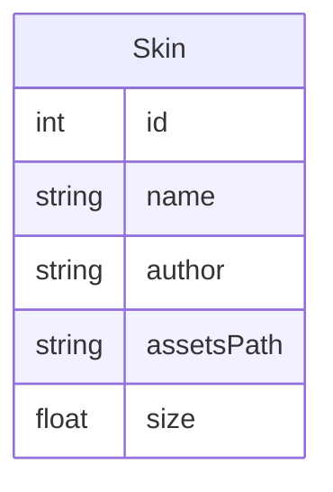

# Projet Dev Desktop de Martin Bonetti
## Conception
### Design
Le design se trouve dans le ficher Design.free. Il doit être ouvert avec (Lunacy)[https://icones8.fr/lunacy] (dispo windows/macOS/Linux)

### Base de donnée
Une base de donnée SQLite `data/data.sqlite` est utilisée pour le mapping des fichers. Elle contient une seule table Skin

