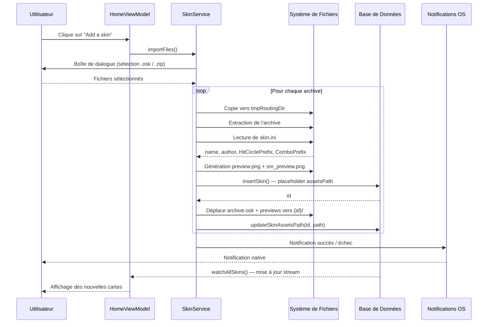
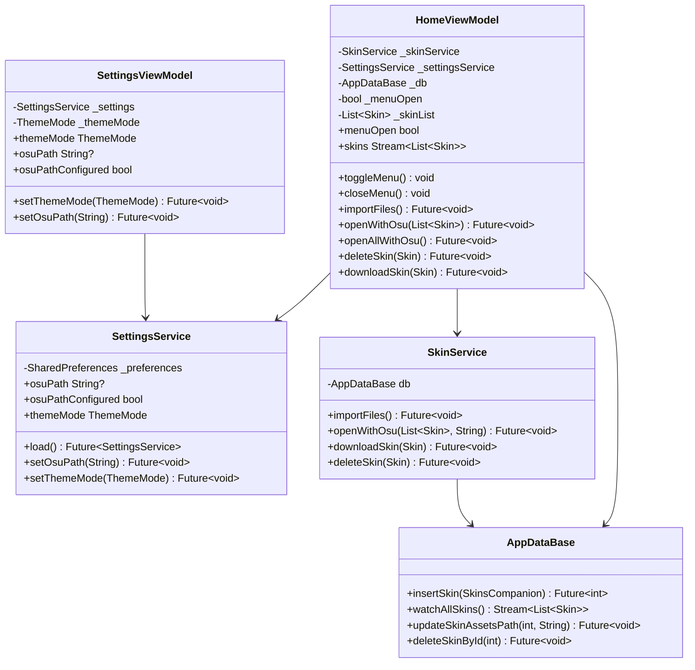
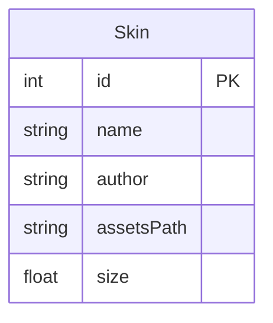

# Routing

## 👥 Auteur
* **Martin Bonetti** (Dev back, Dev front, Designer) - [Lien Github](https://github.com/M-TTI)

---

## 📄 Description
Routing est une application de bureau Flutter permettant de gérer vos skins osu!. Elle importe, stocke et organise les archives `.osk` dans un dossier de support applicatif structuré, et génère automatiquement des prévisualisations composites à partir des assets du skin.
Routing fonctionne aussi bien avec osu!stable qu'avec osu!lazer

### Fonctionnalités Clés

> ⚠️ **Focus Desktop :** Routing stocke automatiquement les fichiers des skins dans le dossier de support applicatif approprié selon le système d'exploitation (`~/.local/share/routing` sur Linux, `%AppData%\Local\routing` sur Windows).
> Utilisation des notifications système de l'OS pour les messages d'erreurs/succès.

* [x] Import de skins (`.osk` / `.zip`) avec validation via `skin.ini`
* [x] Génération automatique de prévisualisations (composition `hitcircle` + `hitcircleoverlay` + chiffre)
* [x] Ouverture d'un ou plusieurs skins directement dans osu!
* [x] Téléchargement de l'archive d'un skin
* [x] Suppression d'un skin
* [x] Notifications natives via la barre de notifications OS
* [x] Thème clair / sombre / système avec persistance
* [x] Paramètres persistants (chemin vers l'exécutable osu!, thème)
* [ ] Listing avec informations supplémentaires pour chaque skin
* [ ] Système de tags pour filtrer les skins et barre de recherche de type elasticSearch.
* [ ] Export et Import groupés des skins vers une autre instance de routing.

## 🎨 Conception & Design
Le design a été réalisé avec [Lunacy](https://icônes8.fr/lunacy), un logiciel de design vectoriel gratuit. Le fichier source `Design.free` se trouve à `/doc/Design.free` du projet et doit être ouvert avec Lunacy (disponible sur Windows, macOS et Linux). Des captures d'écran sont disponibles dans `/assets`

## 📐 Architecture & UML

### Structure du code

Les fichiers du code source se trouvent dans `/src/lib`
Les dépendances se trouvent dans `src/pubspec.yaml`
```
src/lib/                                                                                                              
  ├── main.dart                                                                                                      
  ├── components/                                                                                                       
  │   ├── base_button.dart                                                                                            
  │   ├── nav_bar.dart                                                                                                  
  │   ├── side_menu.dart                                                                                                
  │   ├── skeleton_card.dart                                                                                            
  │   └── skin_card.dart                                                                                                
  ├── databases/                                                                                                        
  │   ├── database.dart                                                                                                 
  │   └── database.g.dart       ← code auto-généré par Drift (Flutter ORM)                                     
  ├── pages/                                                                                                            
  │   ├── home_page.dart
  │   └── dialogs/
  │       ├── osu_path_dialog.dart
  │       └── settings_dialog.dart
  ├── services/
  │   ├── settings_service.dart
  │   └── skin_service.dart
  ├── themes/
  │   └── theme.dart
  └── viewmodels/
      ├── home_viewmodel.dart
      └── settings_viewmodel.dart
```

L'application suit une architecture **MVVM** (Model-View-ViewModel) avec le package `provider` pour l'injection de dépendances.

### Diagramme de séquence


```mermaid
sequenceDiagram                 
      participant U as Utilisateur
      participant VM as HomeViewModel                                                                                   
      participant S as SkinService
      participant FS as Système de Fichiers                                                                             
      participant DB as Base de Données
      participant OS as Notifications OS

      U->>VM: Clique sur "Add a skin"
      VM->>S: importFiles()
      S->>U: Boîte de dialogue (sélection .osk / .zip)
      U-->>S: Fichiers sélectionnés

      loop Pour chaque archive
          S->>FS: Copie vers tmpRoutingDir
          S->>FS: Extraction de l'archive
          S->>FS: Lecture de skin.ini
          FS-->>S: name, author, HitCirclePrefix, ComboPrefix
          S->>FS: Génération preview.png + sm_preview.png
          S->>DB: insertSkin() — placeholder assetsPath
          DB-->>S: id
          S->>FS: Déplace archive.osk + previews vers {id}/
          S->>DB: updateSkinAssetsPath(id, path)
      end

      S->>OS: Notification succès / échec
      OS-->>U: Notification native
      DB-->>VM: watchAllSkins() — mise à jour stream
      VM-->>U: Affichage des nouvelles cartes

```

### Diagramme de classes


```mermaid
classDiagram
    class AppDataBase {
        +insertSkin(SkinsCompanion) Future~int~
        +watchAllSkins() Stream~List~Skin~~
        +updateSkinAssetsPath(int, String) Future~void~
        +deleteSkinById(int) Future~void~
    }

    class SettingsService {
        -SharedPreferences _preferences
        +load() Future~SettingsService~
        +osuPath String?
        +osuPathConfigured bool
        +themeMode ThemeMode
        +setOsuPath(String) Future~void~
        +setThemeMode(ThemeMode) Future~void~
    }

    class SkinService {
        -AppDataBase db
        +importFiles() Future~void~
        +openWithOsu(List~Skin~, String) Future~void~
        +downloadSkin(Skin) Future~void~
        +deleteSkin(Skin) Future~void~
    }

    class HomeViewModel {
        -SkinService _skinService
        -SettingsService _settingsService
        -AppDataBase _db
        -bool _menuOpen
        -List~Skin~ _skinList
        +menuOpen bool
        +skins Stream~List~Skin~~
        +toggleMenu() void
        +closeMenu() void
        +importFiles() Future~void~
        +openWithOsu(List~Skin~) Future~void~
        +openAllWithOsu() Future~void~
        +deleteSkin(Skin) Future~void~
        +downloadSkin(Skin) Future~void~
    }

    class SettingsViewModel {
        -SettingsService _settings
        -ThemeMode _themeMode
        +themeMode ThemeMode
        +osuPath String?
        +osuPathConfigured bool
        +setThemeMode(ThemeMode) Future~void~
        +setOsuPath(String) Future~void~
    }

    HomeViewModel --> SkinService
    HomeViewModel --> SettingsService
    HomeViewModel --> AppDataBase
    SettingsViewModel --> SettingsService
    SkinService --> AppDataBase
```

### Base de données (Schéma Entité(s Relations))

Une base de données SQLite gérée via **Drift** (ORM Flutter). Elle contient une seule table `Skin`.


```mermaid
erDiagram
    Skin {
        int id PK
        string name
        string author
        string assetsPath
        float size
    }
```

### Système de fichiers

L'application stocke ses fichiers dans le supportDir (`%AppData%/local/com.example.routing` pour Windows, `~/.local/share/com.example.routing` pour Linux).

L'arborescence ressemble à ceci

```
[supportDir]/
├── app_database.sqlite     ← Mapping des fichiers
├── README                  ← Message indiquant qu'il ne faut pas toucher tout ça
├── shared_preferences.json ← Settings
└── {id}/                   ← Dossier du skin nommé par son id en base
    ├── archive.osk         ← Archive originelle des skins
    ├── preview.png         ← Image preview (260×260)
    └── sm_preview.png      ← Image preview sm (réactivité) (140×140)
```


## 🛠 Stack Technique
* **Langage :** Dart
* **Framework :** Flutter
* **Base de données :** SQLite via Drift (ORM)
* **State Management :** Provider (Pattern MVVM)
* **Stockage paramètres :** SharedPreferences (Paramètres stockés en json dans le directory support)
* **Notifications :** local_notifier (Notifications OS natives)
* **Outils :** Android Studio (Fork de JetBrains IntelliJ par Google), osu!lazer, Lunacy, Claude Code, Flutter Analyze (outil d'analyse statique)

---

## 📸 Démonstration (Screenshots & Gifs)
> Je vous invite à aller voir la courte démo présente à `/assets/routing_demo.mp4` qui démontre toutes les fonctionnalités de l'application :)

---

## 🚀 Installation & Lancement
Guide pas-à-pas pour qu'un développeur puisse lancer le projet.

Les paquets `libnotify` et `libnotify-dev`/`libnotify-devel` (en fonction de la distribution) sont nécessaires pour build l'application

```bash
# Prérequis Linux (Debian/Ubuntu) — requis pour compiler local_notifier                                               
sudo apt-get install libnotify libnotify-dev
  
# Prérequis Linux (Fedora) — requis pour compiler local_notifier
sudo dnf install libnotify libnotify-devel

# Cloner le dépôt
git clone https://github.com/M-TTI/routing.git

# Se placer dans le répertoire Flutter
cd src/routing

# Installer les dépendances
flutter pub get

# Lancer l'application
flutter run -d linux    # Linux
flutter run -d windows  # Windows
```

---

## 🤖 Section IA & Méthodologie (OBLIGATOIRE)

_Transparence totale requise sur l'usage de l'IA._

L'assistant IA utilisé pendant le développement du projet est **Claude Code** (Anthropic), un agent IA intégré directement dans le terminal de développement, capable de lire, modifier et analyser le code du projet.

### 1. Prompts Utilisés
> Je fais mes prompts en anglais par habitude et pour toujours travailler mon expression dans la langue :)
- _"I want to implement settings persistence for the Osu! executable path and the theme preference. Make a plan for each options : json/yaml persistence or SQLite persistence. Tell me about the packages I could use."_  → Pour concevoir l'architecture du service de paramètres et son intégration.
- _"How can I tackle the 'OpenWithOsu' feature ? Is there a way to get the default system app to open the skin file or should I use the osu binary ?"_ → Pour rechercher les solutions concernant la logique d'ouverture de skins avec l'exécutable osu!.
- _"I added the delete feature for each skin. Look at `databases/database.dart`, is that the right way to do a deletion query with drift ?"_ → Pour m'assurer que je ne me trompe pas dans l'utilisation de drift, dont la syntaxe peut parfois donner confusion.
- _"Now for the image feature: I want to draw a in-game circle image for each skin using their assets. I need to combine 3 elements : `hitcircle@2x.png` (fallback hitcircle.png), `hitcircleoverlay@2x.png` (fallback `hitcircleoverlay.png`) then the number, which need to be parsed from `skin.ini` in the `[Fonts]` section. I need to read the `HitCirclePrefix` or `ComboPrefix` parameter, then look for the right directory and get `[prefix]-1@2x.png` (fallback `[prefix]-1.png`) to get the number one. I then need to combine those 3 pictures and draw `preview.png` and `sm_preview.png` (for reactivity). Help me plan out the logic for this feature."_ → Pour concevoir la génération de prévisualisations composites à partir des assets des skins, **de loin la feature la plus complexe de cette application**.
- Pour certaines erreurs, j'ai aussi juste copié-collé l'erreur. Claude Code a le contexte du projet en permanence et permet de fix assez facilement les différents problèmes rencontrés.

### 2. Modifications Manuelles & Debug
- Bien que Claude Code puisse écrire dans les fichiers pour modifier le code, Je lui ai demandé spécifiquement de ne jamais le faire et j'ai écrit 100% du code à la main. Je n'ai pas eu à corriger d'erreurs dans le code qu'il me proposait mais j'ai dû faire certaines modifications, notamment au niveau de l'architecture pour mieux organiser et m'y retrouver. J'ai également écrit tous les commentaires (**Nécessaires dans `src/lib/services/skin_service.dart` qui contient le gros de la logique et qui peut parfois être difficile à lire**).

### 3. Répartition Code IA vs Code Humain
> L'IA est un outil très utile que j'ai bien pu exploiter mais j'avais tout de même pour but d'utiliser ce projet pour apprendre Flutter afin de l'utiliser pour mes projets perso. J'ai donc fait les efforts nécessaires pour être l'acteur principal dans le projet.
- **Architecture & Structure :** 40% IA / 60% Humain.
- **Logique Métier (Services, ViewModels) :** 40% IA / 60% Humain.
- **Interface (UI / Widgets) :** 20% IA / 80% Humain.
- **Debug & Corrections :** 30% IA / 70% Humain.

---

## ⚖️ Auto-Évaluation
- **Ce qui fonctionne bien :** Toutes les features fonctionnent comme prévu (ou parfois même mieux que prévu) à l'exception de l'image de prévisualisation qui est très pixélisée, mais d'un autre côté j'avais prévu à la base d'abandonner cette idée, je suis content d'avoir pu le faire. La feature Ouvrir avec Osu! fonctionne très bien, et la manière dont je l'ai implémenté fait que osu s'occupe des messages d'erreurs en cas d'échec. Je suis aussi plutôt satisfait du UI (mon point faible), Flutter est puissant et assez simple à prendre en main, j'ai pris le temps au début de créer `src/lib/themes/theme.dart` pour y répertorier mes couleurs, icônes et surcharger le Thème Material pour appliquer tout ça à toute l'app sans trop d'effort. Je suis très satisfait du rendu.

- **Difficultés rencontrées :** **Les images de prévisualisation !** Même à présent, cette feature n'est pas parfaite et le numéro 1 ne s'affiche pas pour certains skins. Osu! permet un grand nombre de manières différentes d'afficher les éléments d'un skin en jeu, ainsi, deux skins peuvent avoir une architecture assez différente et c'est difficile de couvrir tous les cas particuliers. J'ai commencé à développer avec .NET Avalonia et j'ai eu tellement de problèmes lors de la création de l'UI que j'ai tout supprimé et recommencé le projet en Flutter dart. Au final, c'était une bonne décision, j'ai eu beaucoup moins de mal comme ça. J'ai eu aussi la super idée (c'est un mensonge) de m'attaquer à la logique de l'import des skins dans le train lors de mes trajets au travail, lorsque je n'étais pas bien réveillé ce qui, je pense, a un peu augmenté le temps passé sur la feature. Pour finir, j'ai implémenté du lazy loading (`src/lib/components/skeleton_card.dart`) mais les donnés chargent trop vite et on a pas le temps de le voir, Je n'ai pas pu me pencher sur un moyen de ralentir l'appli pour la démo...

- **Si c'était à refaire :** J'aurais commencé directement en Flutter ! Ce qui m'embête le plus par rapport à l'état actuel du projet, c'est le système de notifications qui nécessite une librairie Linux d'installée. Je l'ai laissé comme ça pour l'interaction avec l'OS mais je pense qu'il aurait été mieux de faire des snacks (toasts Flutter, système de notifications interne à l'application). C'est la première chose que je changerais. Aussi, je stocke la taille du skin sans rien en faire pour le moment car je n'ai pas trouvé d'emplacement pour l'afficher dans l'UI sans que ça fasse bizarre, Je réfléchirais à implémenter un show pour chaque skin, pour afficher des informations supplémentaires (dont la taille), un système de tags pour trier les skins et une barre de recherche dans le listing. Aussi la feature d'import/export à laquelle je réfléchis encore mais je n'ai pas encore d'implémentation à proposer.
