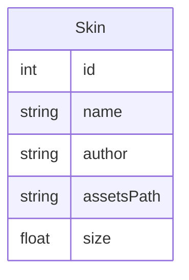

# Projet Dev Desktop de Martin Bonetti
## Conception
### Design
Le design se trouve dans le ficher Design.free. Il doit être ouvert avec [Lunacy](https://icones8.fr/lunacy) (dispo windows/macOS/Linux)

### Base de donnée
Une base de donnée SQLite `data/data.sqlite` est utilisée pour le mapping des fichers. Elle contient une seule table Skin

```mermaid
erDiagram
    Skin {
        int id
        string name
        string author
        string assetsPath
        float size
    }
```


### Logique d'import du skin
1. selectionne archive
2. archive est déplacée vers tmpRoutingDir
3. archive est copiée, une des 2 est extraite
4. vérification avec les asset exraits que c'est bien un skin valide.
5. un dossier est constité :
``` 
dossier
├── archive.zip
└── assets
	└── assets du skins récupérés de l'archive extraite.
```
6. sauvegarde en base de donnée
7. move et rename le dossier par l'id du skin dans RoutingAppData (ou documents/Routing)
8. netoyage de tmpRoutingDir


notes : la première fois que ça se fait, le dossier appdata (ou documents) se crée, avec un README qui indique qu'il ne faut pas toucher à ce qui s'y trouve.
